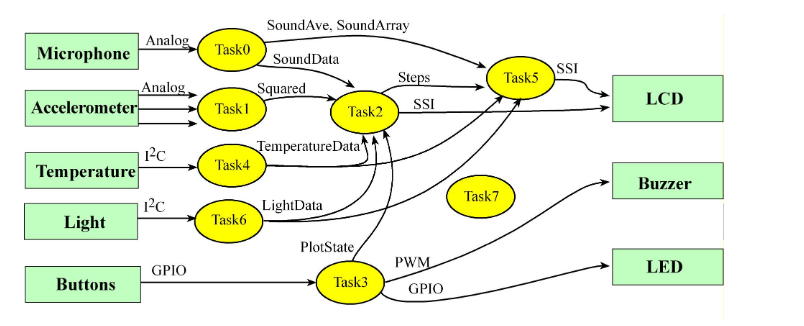

# Embedded-Fitness-Device

An embedded RTOS fitness device used to monitor the microphone, accelerometer, light sensor, temperature sensor and switches before outputting the data to the LCD. Written using C and Assembly on an MSP432 and Educational Booster Pack MKII, the fitness device uses a round robin scheduler with blocking semaphores, thread sleeping, FIFO queues and periodic event tasks with dedicated timer interrupts to get the desired thread execution. In order to monitor the execution of the threads, a virtual logic analyzer was used to debug and measure the jitter. 

Here is a data flow of the fitness device:

